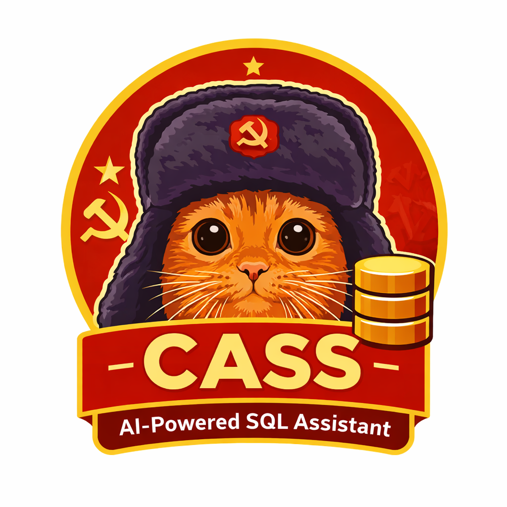

# CASS - Conversational AI SQL System

<p align="center">
  
</p>

<p align="center">
  <strong>🤖 Ask questions in plain English, get SQL answers instantly</strong>
</p>

<p align="center">
  <a href="https://github.com/Cat-Communist-Party-CCP/CASS/blob/main/LICENSE">
    
  </a>
  <a href="https://github.com/Cat-Communist-Party-CCP/CASS/stargazers">
    
  </a>
  <a href="https://python.org">
    
  </a>
</p>

---

## 🎯 What is CASS?

CASS is an **open-source AI-powered SQL assistant** that lets you query databases using natural language. No SQL knowledge required – just ask your question in plain English!

```
You: "Who are our top 5 customers by revenue this month?"

CASS: 
  📝 Generated SQL: SELECT customer_name, SUM(amount) FROM orders...
  📊 Results: [Interactive Table]
  📈 Chart: [Bar Chart Visualization]  
  💬 Answer: "Your top customer is Acme Corp with $45,000..."
```

---

## ✨ Features

| Feature | Description |
|---------|-------------|
| 🗣️ **Natural Language** | Ask questions in plain English |
| 🦙 **100% Local & Free** | Runs on Ollama – no API costs, complete privacy |
| ⚡ **Real-time Streaming** | See responses as they generate |
| 📊 **Rich Visualizations** | Auto-generated tables and charts |
| 🎨 **Modern UI** | Beautiful, responsive chat interface |
| 🐘 **PostgreSQL** | Production-ready database support |
| 🔄 **Smart Fallback** | Automatic model switching for reliability |

---

## 🖼️ Screenshots

<p align="center">
  <i>Screenshots coming soon!</i>
</p>

---

## 🛠️ How It Works

```
┌─────────────────┐     ┌─────────────────┐     ┌─────────────────┐
│   Your Question │ ──▶ │   CASS Agent    │ ──▶ │   SQL Query     │
│   (Plain English)│     │   (Ollama LLM)  │     │   + Results     │
└─────────────────┘     └─────────────────┘     └─────────────────┘
                                │
                                ▼
                        ┌─────────────────┐
                        │   PostgreSQL    │
                        │   Database      │
                        └─────────────────┘
```

1. **You ask** a question in natural language
2. **CASS analyzes** your question using a local AI model
3. **Generates SQL** based on your database schema
4. **Executes safely** and returns results
5. **Visualizes** data with tables and charts

---

## 🚀 Quick Start

### Prerequisites

- [Python 3.10+](https://python.org)
- [Node.js 18+](https://nodejs.org)
- [Ollama](https://ollama.ai) (for local AI)
- [Docker](https://docker.com) (for PostgreSQL)

### Installation

```bash
# 1. Clone the repository
git clone https://github.com/Cat-Communist-Party-CCP/CASS.git
cd CASS

# 2. Install the AI model
ollama pull sqlcoder:7b

# 3. Start the database
docker-compose up -d

# 4. Start the backend
cd backend
python -m venv .venv
source .venv/bin/activate  # Windows: .\.venv\Scripts\Activate.ps1
pip install -r requirements.txt
uvicorn src.cass.server.app:app --reload

# 5. Start the frontend (new terminal)
cd frontend
npm install
npm run dev
```

### 🎉 Open http://localhost:3000 and start asking questions!

---

## 💡 Example Queries

Try asking CASS:

| Query | What it does |
|-------|--------------|
| *"Show me all orders from last week"* | Filters by date range |
| *"What's the average order value by city?"* | Aggregation with grouping |
| *"List products with less than 10 in stock"* | Conditional filtering |
| *"Who are our most active customers?"* | Ranking and sorting |
| *"Compare monthly revenue for 2024"* | Time-series analysis |

---

## 🏗️ Tech Stack

| Layer | Technology |
|-------|------------|
| **AI Model** | [Ollama](https://ollama.ai) + sqlcoder:7b |
| **Backend** | Python 3.10+, FastAPI, SSE Streaming |
| **Frontend** | HTML/CSS/JS, Tailwind CSS |
| **Database** | PostgreSQL 14+ |
| **Deployment** | Vercel (frontend), Railway (backend) |

---

## 📖 Documentation

| Document | Description |
|----------|-------------|
| [Getting Started](docs/GETTING_STARTED.md) | Full installation guide |
| [API Reference](docs/API.md) | Backend API documentation |
| [Architecture](docs/ARCHITECTURE.md) | System design overview |
| [Contributing](CONTRIBUTING.md) | How to contribute |

---

## 🔒 Privacy & Security

- ✅ **100% Local** - Your data never leaves your infrastructure
- ✅ **No API Keys** - Uses local Ollama, no external AI services
- ✅ **SQL Validation** - Blocks dangerous queries (DROP, DELETE without WHERE)
- ✅ **Open Source** - Fully auditable codebase

---

## 🤝 Contributing

We welcome contributions! Here's how to get started:

1. **Fork** the repository
2. **Create** a feature branch (`git checkout -b feature/amazing-feature`)
3. **Commit** your changes (`git commit -m 'Add amazing feature'`)
4. **Push** to the branch (`git push origin feature/amazing-feature`)
5. **Open** a Pull Request

See [CONTRIBUTING.md](CONTRIBUTING.md) for detailed guidelines.

---

## 📄 License

This project is licensed under the **MIT License** - see the [LICENSE](LICENSE) file for details.

---

## ⭐ Support

If you find CASS useful, please consider:

- ⭐ **Starring** this repository
- 🐛 **Reporting** bugs and issues
- 💡 **Suggesting** new features
- 🤝 **Contributing** code or documentation

---

## 📬 Contact

- **GitHub Issues**: [Report a bug](https://github.com/Cat-Communist-Party-CCP/CASS/issues)
- **Discussions**: [Ask questions](https://github.com/Cat-Communist-Party-CCP/CASS/discussions)

---

<p align="center">
  Made with ❤️ by the <a href="https://github.com/Cat-Communist-Party-CCP">Cat Communist Party</a>
</p>
